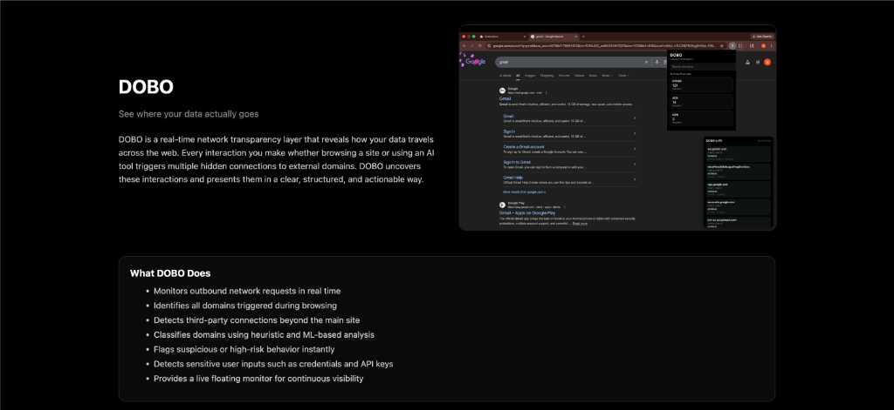
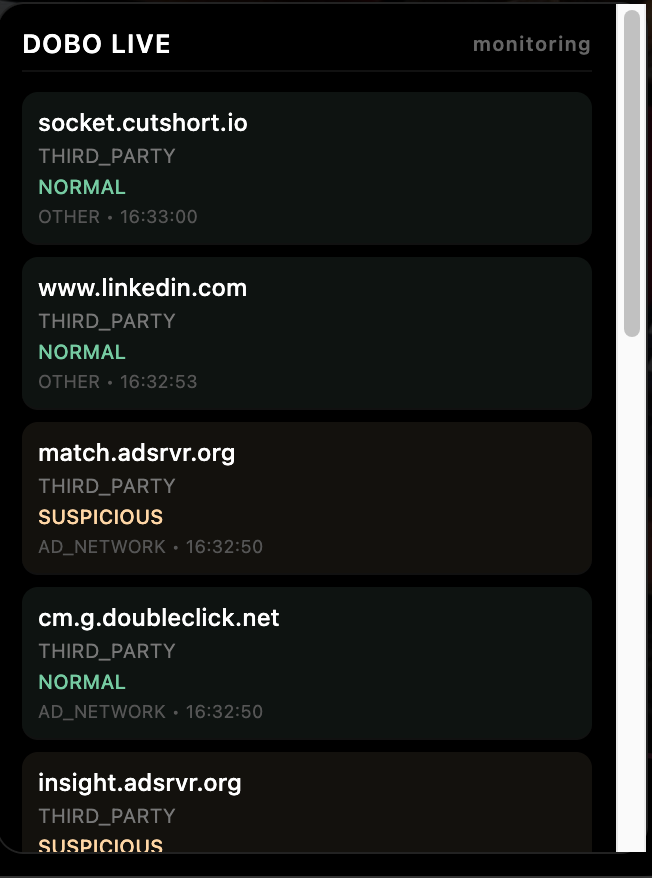
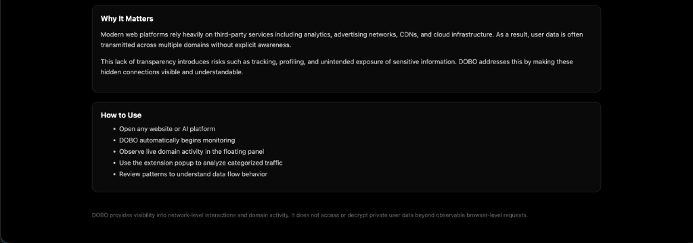

# 🔍 DOBO — Data Transparency Browser Extension

> **See where your data actually goes.**

DOBO is a real-time network transparency layer that reveals how your data travels across the web. Every interaction you make — whether browsing a site or using an AI tool — triggers multiple hidden connections to external domains. DOBO uncovers these interactions and presents them in a clear, structured, and actionable way.

---



---

## ✨ What DOBO Does

- 📡 **Monitors outbound network requests** in real time
- 🔎 **Identifies all domains triggered** during browsing
- 🚦 **Detects third-party connections** beyond the main site
- 🤖 **Classifies domains** using heuristic and ML-based analysis
- ⚠️ **Flags suspicious or high-risk behavior** instantly
- 🔐 **Detects sensitive user inputs** such as credentials and API keys
- 🖥️ **Provides a live floating monitor** for continuous visibility

---

## 📸 Screenshots

### Live Monitoring Panel

The DOBO floating panel injects into every page you visit, showing real-time domain activity — categorized, risk-rated, and timestamped.



---

### Onboarding & How to Use

When first installed, DOBO walks you through its purpose and how to get the most out of it.



---

## 🧠 Why It Matters

Modern web platforms rely heavily on third-party services including analytics, advertising networks, CDNs, and cloud infrastructure. As a result, user data is often transmitted across multiple domains **without explicit awareness**.

This lack of transparency introduces risks such as:
- 🕵️ Tracking and profiling
- 📊 Unintended data exposure to ad networks
- 🔑 Sensitive inputs sent to unknown endpoints

DOBO makes these hidden connections **visible and understandable**.

---

## 🛠️ Tech Stack

| Component | Technology |
|---|---|
| Browser Extension | Chrome Manifest V3, Vanilla JS |
| Live Panel | Injected Content Script (`content.js`) |
| Request Interception | `chrome.webRequest` API |
| ML Backend | Python, Flask, scikit-learn |
| Domain Classification | Heuristic rules + Random Forest model |

---

## 🗂️ Project Structure

```
dobo/
├── extension/          # Chrome extension source
│   ├── manifest.json   # MV3 manifest
│   ├── background.js   # Service worker — intercepts & classifies requests
│   ├── content.js      # Injects the live floating panel into pages
│   ├── popup.html/js   # Extension popup UI
│   ├── onboarding.html # First-install onboarding page
│   └── *.png           # Extension icons
├── ml/                 # ML backend
│   ├── app.py          # Flask API server (/predict endpoint)
│   ├── train.py        # Model training script
│   ├── model.pkl       # Trained Random Forest model
│   ├── scaler.pkl      # Feature scaler
│   └── vectorizer.pkl  # Text vectorizer
├── model.pkl           # Root-level model artifact
└── scaler.pkl          # Root-level scaler artifact
```

---

## 🚀 Getting Started

### 1. Load the Extension

1. Open Chrome and navigate to `chrome://extensions/`
2. Enable **Developer Mode** (top right)
3. Click **Load Unpacked**
4. Select the `extension/` folder

### 2. Run the ML Backend (Optional but Recommended)

The ML backend enhances domain classification with a trained Random Forest model.

```bash
# Navigate to the ml directory
cd ml

# Create and activate a virtual environment
python3 -m venv venv
source venv/bin/activate  # On Windows: venv\Scripts\activate

# Install dependencies
pip install flask scikit-learn numpy

# Start the server
python app.py
```

The Flask server will run at `http://localhost:5000`. The extension will automatically use it if available, falling back to heuristic classification if not.

### 3. Start Browsing

Open any website. DOBO will automatically:
- Begin monitoring all outbound network requests
- Display a live panel in the bottom-right corner of every page
- Color-code domains by risk level:
  - 🟢 **NORMAL** — benign domains
  - 🟡 **SUSPICIOUS** — potential trackers or ad networks
  - 🔴 **HIGH_RISK** — known malicious or highly suspicious domains

---

## 🤖 ML Classification

The ML backend (`ml/app.py`) exposes a `/predict` endpoint that accepts a domain name and returns a risk classification.

**Features extracted per domain:**
- Domain length
- Presence of tracking keywords (`ads`, `track`, `analytics`, `pixel`)
- Known bad domain flag
- Subdomain count
- Presence of hyphens or digits
- TLD risk score (`.xyz`, `.ru`, `.cn`, etc.)

**Risk levels:**
| Confidence | Risk Level |
|---|---|
| > 0.7 | `HIGH_RISK` |
| 0.4 – 0.7 | `SUSPICIOUS` |
| < 0.4 | `NORMAL` |

---

## 🔒 Privacy

DOBO provides visibility into **network-level interactions and domain activity**. It does **not** access or decrypt private user data beyond observable browser-level requests. All analysis happens locally — no data is sent to external servers.

---

## 📄 License

MIT License — feel free to use, modify, and distribute.
